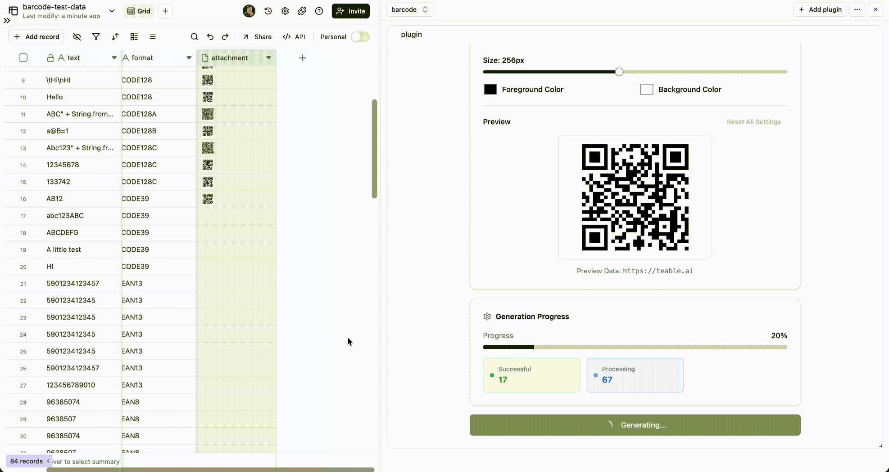

# Teable 条形码与二维码生成器插件

一个强大的 [Teable](https://teable.ai) 插件，用于从表格数据生成条形码和二维码，并保存为可下载的附件。

## ✨ 功能特色

### 条形码生成
- 📊 **多种条形码格式** - 支持20+种条形码格式，包括CODE128、EAN、UPC、CODE39、ITF、MSI等
- 🎨 **外观自定义** - 完全控制宽度、高度、颜色、边距和文本显示
- 📝 **文本自定义** - 自定义字体、大小、样式、位置和对齐方式
- 🔄 **批量生成** - 一次生成多条记录的条形码
- 👁️ **实时预览** - 生成前实时预览条形码外观

### 二维码生成
- 🔲 **二维码支持** - 生成可自定义纠错级别的二维码
- 🎨 **外观自定义** - 控制大小、前景/背景颜色
- 📐 **纠错级别** - 从L(~7%)、M(~15%)、Q(~25%)、H(~30%)中选择，推荐H级别
- 📁 **多种格式** - 支持PNG和SVG输出格式
- 👁️ **实时预览** - 实时预览二维码外观

### 通用功能
- 🎯 **字段映射** - 灵活选择源数据字段和目标附件字段
- 📈 **进度跟踪** - 精美的卡片式UI，显示实时生成进度和统计信息
- 🎨 **主题支持** - 完整的明暗模式兼容，自动主题检测
- 🌍 **国际化** - 完整的i18n支持（英文/中文）
- 📱 **响应式设计** - 针对所有屏幕尺寸优化
- ⚡ **性能优化** - 使用React Query进行高效数据处理
- 🛡️ **错误处理** - 全面的错误报告
- 🔌 **Teable集成** - 与Teable表格和字段无缝集成
- 🎛️ **标签页界面** - 在条形码和二维码生成模式之间轻松切换

## 🚀 技术栈

### 核心框架
- **Next.js 14.2.14** - 带App Router的React全栈框架
- **React 18.2.0** - 现代React功能的UI库
- **TypeScript 5** - 类型安全的JavaScript超集

### UI与样式
- **Tailwind CSS 3.4.1** - 原子CSS框架
- **@teable/ui-lib** - Teable官方UI组件库

### 状态管理
- **@tanstack/react-query 4.36.1** - 服务器状态管理和缓存
- **React Context** - 客户端状态管理

### 条形码生成
- **jsbarcode 3.12.1** - JavaScript条形码生成库

### 二维码生成
- **qrcode 1.5.4** - 二维码生成库

### Teable生态系统
- `@teable/sdk` - 插件桥、UI配置、工具
- `@teable/openapi` - API客户端和类型定义
- `@teable/core` - 核心类型定义和工具

### 国际化
- **react-i18next 14.1.0** - React国际化框架
- **i18next 23.10.1** - 核心国际化库

## 📈 最新优化成果

### 代码质量提升 (2025年11月更新)
- 🔧 **代码瘦身** - 减少约467行重复代码，提升20%代码效率
- 🏗️ **架构重构** - 统一条形码和二维码转换逻辑，使用适配器模式
- 📦 **依赖优化** - 移除未使用依赖，减少Bundle大小约50KB
- 🎯 **类型安全** - 简化类型定义，提升类型安全性
- ⚡ **性能提升** - 共享转换逻辑减少运行时开销

### 技术架构亮点
- **泛型设计** - 类型安全且可扩展的代码生成架构
- **适配器模式** - 灵活支持不同的代码生成器
- **单一职责原则** - 每个Hook专注于特定功能
- **QPS限制** - 智能队列管理，避免服务器过载
- **实时进度跟踪** - 基于成功上传的准确进度显示

## 🚀 快速开始

### 前置要求

- Node.js 18+
- npm 或 yarn

### 安装依赖

```bash
npm install
```

### 开发模式

```bash
npm run dev
```

开发服务器将在 http://localhost:3001 启动

### 生产构建

```bash
npm run build
npm start
```

## 📖 使用指南

### 条形码生成

<div align="center">
  
</div>

1. **切换到条形码标签页** - 选择"条形码"标签
2. **选择视图** - 选择包含要处理记录的视图
3. **选择数据源字段** - 选择包含条形码生成数据的字段（文本或数字字段）
4. **选择附件字段** - 选择存储生成条形码的附件字段
5. **配置条形码** - 自定义条形码格式、外观和文本设置
6. **预览** - 实时查看条形码外观
7. **生成** - 点击"生成条形码"处理所有记录
8. **查看结果** - 生成的条形码以图片形式保存在附件字段中

### 二维码生成

<div align="center">
  
</div>

1. **切换到二维码标签页** - 选择"二维码"标签
2. **选择视图** - 选择包含要处理记录的视图
3. **选择数据源字段** - 选择包含二维码生成数据的字段（文本或数字字段）
4. **选择附件字段** - 选择存储生成二维码的附件字段
5. **配置二维码** - 自定义纠错级别、大小、颜色和输出格式
6. **预览** - 实时查看二维码外观
7. **生成** - 点击"生成二维码"处理所有记录
8. **查看结果** - 生成的二维码以图片形式保存在附件字段中

## 🔧 配置选项

### 基本设置

- **条形码类型** - 从20+种条形码格式中选择：
  - CODE128系列 (CODE128, CODE128A, CODE128B, CODE128C)
  - EAN系列 (EAN-13, EAN-8, EAN-5, EAN-2)
  - UPC系列 (UPC-A, UPC-E)
  - CODE39
  - ITF系列 (ITF, ITF-14)
  - MSI系列 (MSI, MSI10, MSI11, MSI1010, MSI1110)
  - Pharmacode
  - Codabar
- **文件格式** - PNG或SVG输出格式
- **GS1-128** - 为CODE128系列启用GS1-128编码
- **紧凑格式** - 为EAN/UPC系列启用平面编码

### 外观设置

- **宽度** - 条形码线条宽度 (1-10px)
- **高度** - 条形码高度 (50-200px)
- **条形码颜色** - 自定义条形码线条颜色
- **背景颜色** - 自定义背景颜色

### 文本设置

- **显示文本** - 切换条形码下方/上方文本显示
- **自定义文本** - 覆盖默认文本（留空使用条形码数据）
- **字体** - 从多种字体系列中选择
- **字体样式** - 默认、粗体、斜体或粗斜体
- **字体大小** - 可调节10-40px
- **文本位置** - 顶部或底部
- **文本对齐** - 左对齐、居中或右对齐
- **文本边距** - 条形码与文本间距 (0-20px)

### 边距设置

- **统一边距** - 一次性设置所有边距 (0-50px)
- **单独边距** - 分别自定义上、下、左、右边距

### 二维码设置

- **纠错级别** - 从4个级别中选择：
  - **L (~7%)** - 低纠错，最高容量
  - **M (~15%)** - 中等纠错，良好平衡
  - **Q (~25%)** - 四分之一纠错，更好可靠性
  - **H (~30%)** - 高纠错，最高可靠性（推荐）
- **尺寸** - 二维码尺寸 (50-512px)
- **前景颜色** - 二维码图案颜色
- **背景颜色** - 二维码背景颜色
- **文件格式** - PNG（默认）或SVG输出格式

## 🌐 国际化

插件支持以下语言：
- 🇺🇸 英文 (en)
- 🇨🇳 简体中文 (zh)

翻译文件位于 `src/locales/` 目录中。

## 📁 项目结构

```
src/
├── app/                 # Next.js App Router
├── components/          # React组件
│   ├── CodeGenerator/   # 条形码/二维码生成器组件
│   ├── QRCodePreview.tsx     # 二维码预览组件
│   └── ...            # 其他UI组件
├── hooks/              # React Hooks
│   ├── useBaseCodeConversion.ts  # 通用代码转换基础Hook
│   ├── useBarcodeConversion.ts   # 条形码转换Hook
│   ├── useQRCodeConversion.ts    # 二维码转换Hook
│   └── ...            # 其他自定义Hooks
├── lib/                # 工具库
├── locales/            # 国际化文件
├── types/              # TypeScript类型定义
└── utils/              # 工具函数
    ├── barcodeGenerator.ts  # 条形码生成逻辑
    ├── qrCodeGenerator.ts  # 二维码生成逻辑
    ├── uploadQueue.ts       # 上传队列管理
    └── ...                # 其他工具函数
```

## 🔌 Teable插件架构

### URL参数配置
插件通过URL参数接收配置：
- `baseId`, `pluginId`, `pluginInstallId` - Teable标识符
- `tableId` - 目标表格ID
- `lang`, `theme` - 本地化和主题设置

### 插件桥通信
使用 `@teable/sdk` 的 `usePluginBridge()` hook 用于：
- 主机环境通信
- 通过 `getSelfTempToken()` 进行身份验证
- 实时事件监听

## 🎯 支持的条形码格式

### CODE128系列
- **CODE128** - 通用，支持完整ASCII
- **CODE128A** - 大写字母、数字和控制字符
- **CODE128B** - 大小写字母和数字
- **CODE128C** - 仅数字（压缩）

### EAN系列
- **EAN-13** - 13位欧洲商品编号
- **EAN-8** - 8位欧洲商品编号
- **EAN-5** - 5位补充
- **EAN-2** - 2位补充

### UPC系列
- **UPC-A** - 12位通用产品代码
- **UPC-E** - 6位压缩UPC

### 其他格式
- **CODE39** - 字母数字条形码
- **ITF** - 交错2of5
- **ITF-14** - 14位ITF
- **MSI** - 改进Plessey变体
- **Pharmacode** - 制药二进制码
- **Codabar** - 自校验条形码

## 🤝 贡献

欢迎提出问题和拉取请求以改进此插件！

## 📄 许可证

MIT许可证

## 🔗 相关链接

- [Teable官方网站](https://teable.ai)
- [Next.js文档](https://nextjs.org/docs)
- [JsBarcode文档](https://github.com/lindell/JsBarcode)
- [QRCode.js文档](https://github.com/soldair/node-qrcode)